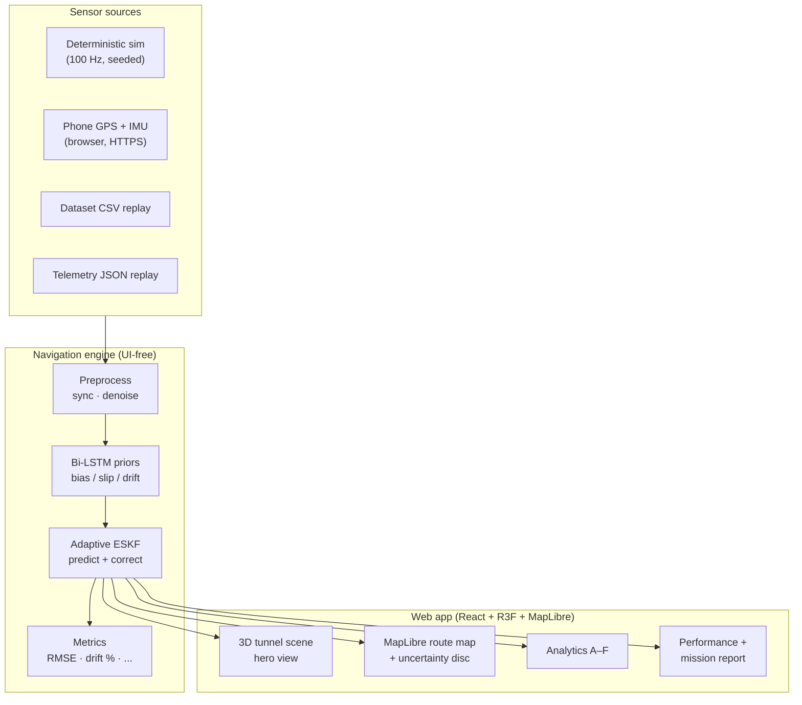

# SIH26168 — AI/ML Based Intelligent Dead Reckoning for Seamless Navigation

**Smart India Hackathon · Theme: Smart Vehicles · Team Techminds_01**

When GNSS disappears — tunnels, urban canyons, indoor parking — a vehicle must keep
navigating. This platform runs a real navigation engine (IMU → Bi-LSTM bias/slip
priors → adaptive error-state Kalman filter → trajectory + uncertainty) and proves
it live: ground truth vs raw dead reckoning vs AI+ESKF, with every metric computed
from the current run. Nothing is hardcoded; demo data is always labelled SIMULATION.

Live demo: `https://sih26168-ai-navigator.vercel.app`

---

## 1. Problem

GNSS is accurate under open sky and absent exactly where navigation matters most:
tunnels, urban canyons, multilevel parking, dense foliage. Pure inertial dead
reckoning integrates accelerometer/gyro noise and bias — position error grows
unbounded within seconds. The vehicle needs a self-contained estimator that bounds
that drift using only onboard sensing plus learned error models.

## 2. Solution

A Bi-LSTM watches recent IMU/odometry windows and predicts the hidden sensor
errors (gyro bias, accel bias, wheel slip, drift). An adaptive 15-state ESKF
(planar 8-state core + 7 fixed priors, see `eskf/eskf_15state.py`) fuses IMU,
wheel odometry, GNSS when available, and the AI priors — down-weighting whatever
source currently disagrees (slip, noise, outage). Result: the AI+ESKF trajectory
stays near ground truth through full GNSS denial, with filter covariance driving
a live uncertainty disc on the map.

## 3. Architecture



Repository map (adjusted to what actually exists):

| Path | Role |
|---|---|
| `src/lib/sim/engine.ts` | Deterministic TS engine — same physics as backend, runs the UI standalone |
| `src/components/console/TunnelScene.tsx` | R3F 3D hero: road/tunnel/trajectories/vehicle, 6 damped cameras, clickable markers |
| `src/components/map/NavMap.tsx` | MapLibre map: true route + projected estimator trails + covariance disc |
| `src/lib/report.ts` | Mission-report builder (JSON/CSV export, live values only) |
| `simulation/` | NumPy truth + sensor stream generator (seeded) |
| `eskf/eskf_15state.py` | Standard + adaptive ESKF, gated updates, covariance history |
| `models/bilstm.py` | Predictor with identical DEMO/LIVE interface |
| `training/` | Synthetic data generation + Bi-LSTM training |
| `datasets/dataset_loader.py` | KITTI/EuRoC adapter plug-in point + CSV schema |
| `utils/metrics.py` | RMSE/final/heading/drift%/slip-accuracy — documented formulas |
| `backend/app.py` | FastAPI: health/simulate/train/model-info + 10 Hz WS stream |
| `tests/test_engine.py` | 6 deterministic pytest tests (seed 7) |
| `backend/Dockerfile` | Production backend container |

## 4. Navigation pipeline

`PHONE/SIM FRAME → VEHICLE FRAME → PREPROCESS → AI VELOCITY/BIAS PRIORS → INERTIAL MECHANIZATION → ESKF → NHC (wheel odometry as forward-speed + zero lateral-slip assumption, documented in engine) → ROUTE-PROJECTION MAP MATCHING → POSITION/VELOCITY/HEADING + COVARIANCE → GNSS RECOVERY RE-SYNC`

Phone-to-vehicle alignment: the browser path (`src/lib/mobile.ts`) reads raw
device axes and fuses them without claiming a calibrated mount — alignment
quality is *not* overstated; distant platforms (rover/drone/spacecraft) are
explicitly labelled SIMULATED TELEMETRY.

## 5. AI model

Bi-LSTM (`in 6 → hid 64 ×2 layers → out 4`: gyro bias, accel bias, slip logit,
drift), 5 s IMU windows. `Predictor` auto-loads `models/bilstm_demo.pt` when
present (LIVE INFERENCE) else uses the deterministic physics-informed stand-in
(DEMO INFERENCE) — same I/O, UI always shows which mode is active. Train:

```powershell
pip install torch --index-url https://download.pytorch.org/whl/cpu
python training/generate_data.py --out training/data.npz --runs 60
python training/train_bilstm.py --data training/data.npz --epochs 15 --out models/bilstm_demo.pt
```

On-device latency is **not** measured in the browser demo; the mission report
records `ai_inference_latency_ms: null` with that note instead of inventing a number.

## 6. ESKF

Predict every IMU step; correct with wheel odometry every step (adaptive noise
follows the innovation); correct with GPS only when available and gated;
correct with Bi-LSTM priors at 10 Hz (adaptive filter only). Inside outages GPS
weight → 0 and covariance grows slowly (AI) vs fast (standard) vs unbounded
(raw) — the uncertainty disc visualizes exactly this.

## 7. GNSS outage handling

State machine (all transitions visible in UI): `AVAILABLE → DEGRADED → LOST →
DRIFT → AI+ESKF FUSION → CORRECTED → RECOVERED`. Outage durations are
configurable (5/10/30/60/120 s presets set tunnel length at current speed) or
forced manually. Recovery re-anchors filters to satellite fixes; recovery time
is observable in the timeline, not asserted.

## 8. Map matching

Current layer: estimator positions are projected onto the surveyed highway
centerline for visualization and route-progress accounting. Full HMM
road-graph matching is future work — the provider abstraction (MapLibre,
keyless CARTO tiles) is ready for it.

## 9. Mobile architecture

Browser path today (phone GPS + motion + compass over HTTPS, `src/lib/mobile.ts`).
Native path (React Native/Expo) is designed but not built: same engine
interface, sensors via expo-sensors/expo-location, on-device inference via
ONNX, backend only for analytics/replay. No background-location permission is
requested by the web app.

## 10. Dataset

CSV header: `timestamp,ax,ay,az,gx,gy,gz,wheel_speed,gps_lat,gps_lon,gps_alt,ground_truth_x,ground_truth_y,ground_truth_z`.
Upload in Settings → Dataset Playback; KITTI/EuRoC via `datasets/dataset_loader.py`
(`load_kitti`/`load_euroc`). Never auto-download restricted data.

## 11. Evaluation

Formulas (`utils/metrics.py`, mirrored live in TS):

- RMSE = √(mean(err²)); Final = err[-1]; Max = max(err)
- Drift % = final_error / distance × 100
- Drift cut = (mean(raw) − mean(ai)) / mean(raw) × 100
- Heading RMSE in degrees; velocity RMSE in m/s; slip accuracy = flagged/total slip frames

Ablation available today: Raw DR (A) vs Standard ESKF (B) vs AI+ESKF (C) —
Performance view + mission report. NHC-isolated and full-system variants are
future experiments, not claimed.

## 12. Deployment

Frontend: Vercel (`npm run build` → `dist/`). Backend: Docker (`backend/Dockerfile`)
or `uvicorn backend.app:app --port 8000`. No database required; no secrets
required (see `.env.example`). Details: `DEPLOYMENT.md`; checklist:
`DEPLOYMENT_CHECKLIST.md`.

## 13. Local setup

```powershell
cd sih-dead-reckoning
npm install
npm run dev        # → http://localhost:5173/#/navigation (boots into running 3D sim)
npm run build      # production build (also runs tsc)
npm run lint
pip install -r backend/requirements.txt pytest
python -m pytest tests/ -q
uvicorn backend.app:app --reload --port 8000
```

## 14. Environment variables

None required. See `.env.example` (optional overrides only: `PORT`, `BACKEND_URL`).

## 15. Testing

`tests/test_engine.py` — 6 deterministic tests (seed 7): determinism, outage
existence, AI-beats-raw, formula identity, covariance growth in outage, no-NaN.
Frontend: `tsc -b` + `oxlint` + production build in CI (`.github/workflows/ci.yml`).

## 16. Demo instructions

1. Open `#/navigation` — 3D bike sim auto-runs (Follow cam).
2. Press CONTROL → `★ SIH DEMO MODE` — 75 s GPS-loss → correction story.
3. Or GPS ON/OFF · LOSS manually, INJECT DRIFT/SLIP/NOISE, watch raw (red)
   diverge while AI+ESKF (cyan) holds; shaded bands mark the outage in Analytics.
4. End screen / Performance → export mission JSON/CSV.

## 17. Limitations (honest)

- All trajectories are synthetic (seeded physics), not road-recorded sensor data.
- Browser demo inference is a stand-in until `bilstm_demo.pt` is trained.
- AI latency not measured in-browser; edge/ONNX conversion not done.
- No native mobile app yet; no database/auth (none needed for the demo loop).
- Map matching is route-projection, not HMM road-graph matching.
- 3D labels are constant screen size by design (readability over perspective).

## 18. Future work

Recorded-data validation (IO-VNBD adapter), HMM map matching, Expo app with
on-device ONNX inference + measured latency, NHC-isolated ablation (D/E),
WebSocket live mirror in the web UI, Postgres/S3 mission store.
